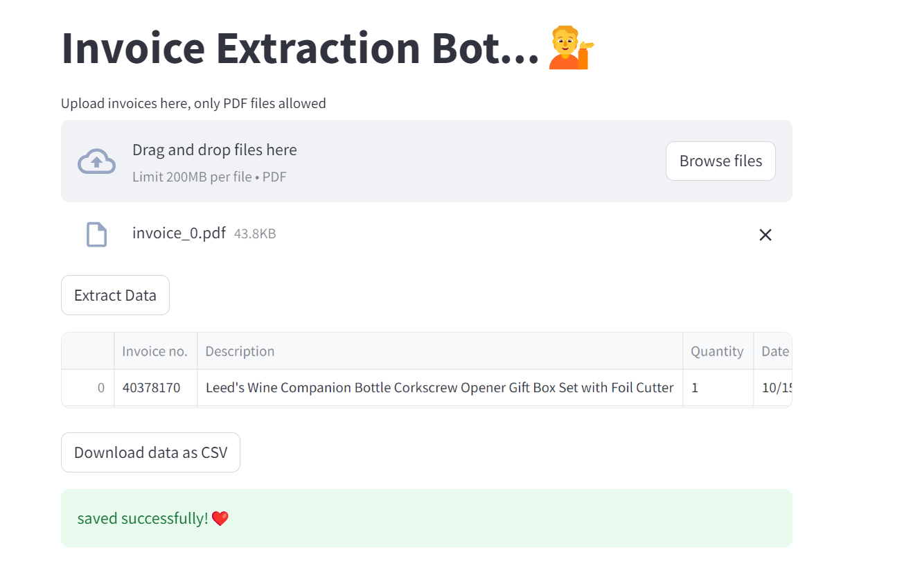

## **Overview**
The Invoice Extraction Bot is a streamlined tool designed to automate the extraction of key information from PDF invoices. By leveraging advanced AI and NLP techniques, the bot simplifies the process of retrieving crucial details such as invoice numbers, item descriptions, quantities, dates, unit prices, totals, and contact details. This data can then be exported to a CSV file for further analysis or record-keeping.

## **Key Features**

- **PDF Processing**: Upload and process multiple PDF invoices to automatically extract relevant information.
- **AI-Powered Extraction**: Utilize OpenAI's language model to accurately extract structured data from unstructured text in PDF documents.
- **Data Export**: The extracted information is neatly organized into a CSV file, ready for download and use.
- **User-Friendly Interface**: The Streamlit-powered web interface ensures a smooth and intuitive experience for processing invoices.

## **Project Structure**

- **`app.py`**: The main application script responsible for PDF uploads, data extraction, and CSV export.
- **`requirements.txt`**: A text document listing all the required Python packages.
- **`.env`**: Configuration file for storing environment variables, such as the OpenAI API key.
- **`Invoice_Bot_Demo.ipynb`**: A Jupyter notebook that demonstrates the full workflow of the code.
- **`invoice_bot.png`**: The image used in this README.
- **`invoice_0.pdf`**: A sample PDF file used for testing the invoice extraction functionality.
